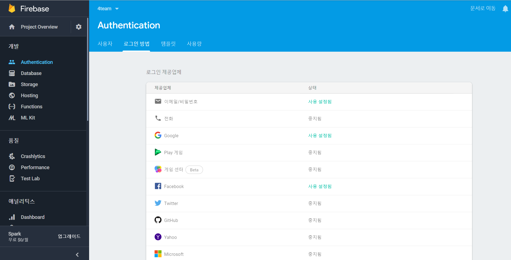
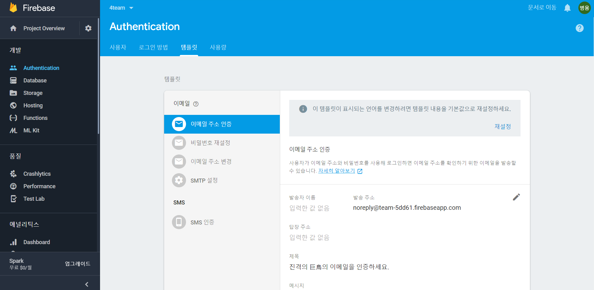
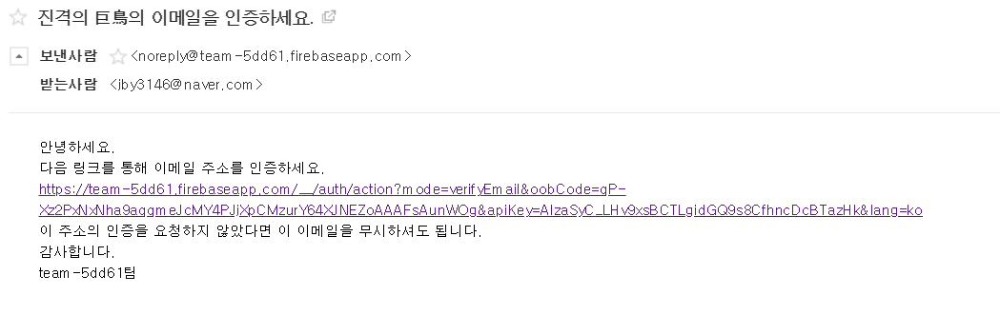

# readMe

### req3. 로그인

1. 구글 로그인 , 페이스북 로그인 ,이메일 로그인을 firebase 프로젝트에서 사용할 수 있도록합니다. 
2. Oauth를 이용해 로그인, 세션유지

> **Firebase 로그인 방법 설정**
>
> [https://console.firebase.google.com](https://console.firebase.google.com/)에서 프로젝트를 생성 후 진행,
>
>
>
> **firebase consol**창으로 이동후 **Authentication**을 선택 로그인 방법에서 사용 설정해준다.
>
> 
>
>**로그인**을 하였을때 **firebase** 안에 내장되어있는 메소드로 **oAuth >인증하기**
>
>***-구글***
> ```js
> loginWithGoogle() { 
>    let provider = new firebase.auth.GoogleAuthProvider();
>    return firebase
>      .auth()
>      .signInWithPopup(provider)
>      .then(function(result) {
>        userLogin({});
>        return result;
>      })
>      .catch(function(err) {
>        console.error("[Google Login Error]", err);
>      });
>  },
> ```
>***-페이스북***
>
> ```js
>  loginWithFacebook() {
>    let provider = new firebase.auth.FacebookAuthProvider();
>    return firebase
>      .auth()
>      .signInWithPopup(provider)
>      .then(function(result) {
>        userLogin({});
>        return result;
>      })
>     .catch(function(err) {
>        console.error("[Facebook Login Error]", err);
>      });
> },
> ```
>***-이메일로그인***
>
>```js
>loginWithEmail(email, password) {
>    return firebase
>      .auth()
>      .signInWithEmailAndPassword(email, password)
>      .then(function(user) {
>        userLogin({});
>        return user;
>      })
>      .catch(function(err) {
>        console.error("[email Login Error]", err);
>      });
>  },
>
>```
>
>
>***-로그아웃***
>
>```js
>logout() {
>    firebase
>      .auth()
>      .signOut()
>      .then(function() {
>        userLogout({});
>      }).catch(function(err) {});
>  },
>```
>***-세션유지***
>
>```js
>session() {
>    firebase.auth().onAuthStateChanged(function(user) {
>      if (user) {
>        store.commit("session", user);
>      } else {}
>    });
>  }
>```
>
>
>
>*auth().onAuthStateChanged* 라는 함수는 계정상태가 변했을 때를 체크한다 
>
>store.js
>```js
>import Vue from "vue";
>import Vuex from "vuex";
>
>Vue.use(Vuex);
>
>export default new Vuex.Store({
>  state: {
>    accessToken: "",
>    user: ""
>  },
>  mutations: {
>    session(state, user) {
>      state.user = user;
>    }
>  }
>});
>
>```
>만약 user가 있다면 vuex의 store에 계정 정보를 저장한다.

### req4. 회원가입

1. 이메일 회원가입
2. 이메일 인증, 계정 추가정보 등록

>
>**이메일 회원가입**
>
> ```js
>  signUp(email, password, userName) {
>    let user
>    firebase
>      .auth()
>      .createUserWithEmailAndPassword(email, password)
>      .then(function() {
>        user = firebase.auth().currentUser; //현재 가입한 유저 불러오기
>      })
>      .then(function() {
>        user.updateProfile({
>          displayName: userName, //displayName에 유저 이름 저장
>        });
>        user.sendEmailVerification().then(function() { //인증 이메일 발송
>        }).catch(function(error) {
>          console.error('인증메일 발송 에러', error);
>        });
>      })
>  },
> ```
> **firebase consol**창으로 이동후 **Authentication**을 선택 **탬플릿**에서 메일 템플릿 변경이 가능하다.
> 
>
>받은 이메일의 모습
>인증을 해주면 유저정보에 verify email이 true로 바뀐다
> 
>
>유효한 이메일일 경우에만 다른 기능을 할수 있도록 지정 가능하다
>
### 좋아요 기능

1. Firebase DB에 저장
2. 저장해놓은 데이터 불러와서 화면에 표시

>**Firebase DB에 저장**
>
> ```js
>//DB에 USER정보가 있다면 기존 데이터 삭제 없으면 저장
>updateLike(board_id, c_name, uid){
>    var like = firestore.collection(c_name).doc(board_id)
>    return this.userLikeCheck(uid,board_id,c_name)
>      .then(res => {
>        if (res) {
>          return like.collection(LIKES).doc(uid).delete()>;
>        }else {
>          return like.collection(LIKES).doc(uid).set({
>            uid:uid
>          })
>        }
>      })
>  },
> //DB 불러오기
 > getLike(board_id, c_name){
>    const likeCollection = firestore.collection(c_name)>.doc(board_id).collection(LIKES)
>    return likeCollection
>      .get()
>      .then(docSnapshots =>{
>        return docSnapshots.docs.map(doc =>{
>          let data = doc.data();
>          return data;
>        })
>      })
>  },
> //유저의 자료가 있는지 확인하기
>  >userLikeCheck(email,board_id,c_name) {
>    return firestore
>      .collection(c_name)
>      .doc(board_id)
>      .collection(LIKES)
>      .doc(email)
>      .get()
>      .then(doc => {
>        if (doc.exists) {
>          return true;
>        } else {
>          return false;
>        }
>      });
>  },
> ```
>
>받은 이메일의 모습
>인증을 해주면 유저정보에 verify email이 true로 바뀐다

>**저장해놓은 데이터 불러와서 화면에 표시**
>
>```js
>getLikeFlag() {
>      FirebaseService.userLikeCheck(this.$store.state.user.email, this.id, "posts").then(res => {
>        this.flag = res;
>      });
>    },
>```
>값을 가져와 flag에 저장한다.
>
>