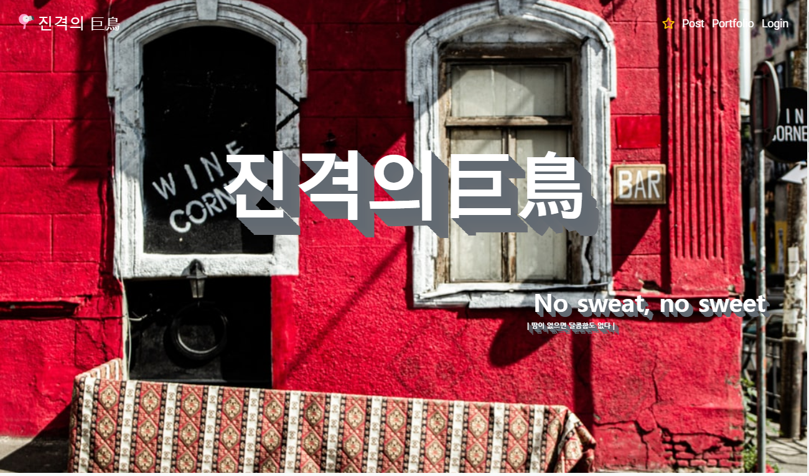
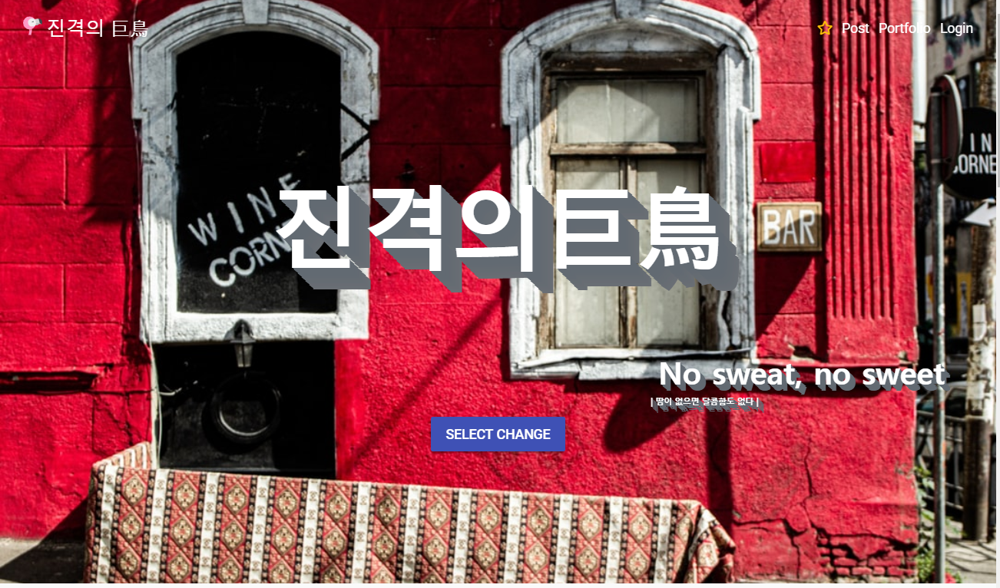
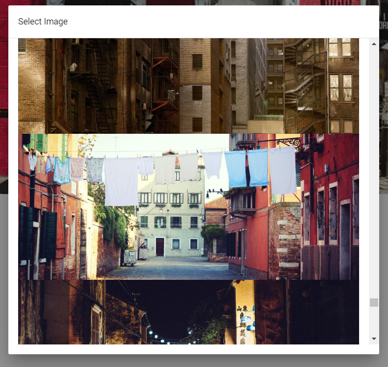
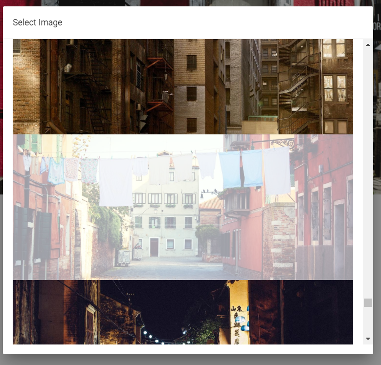
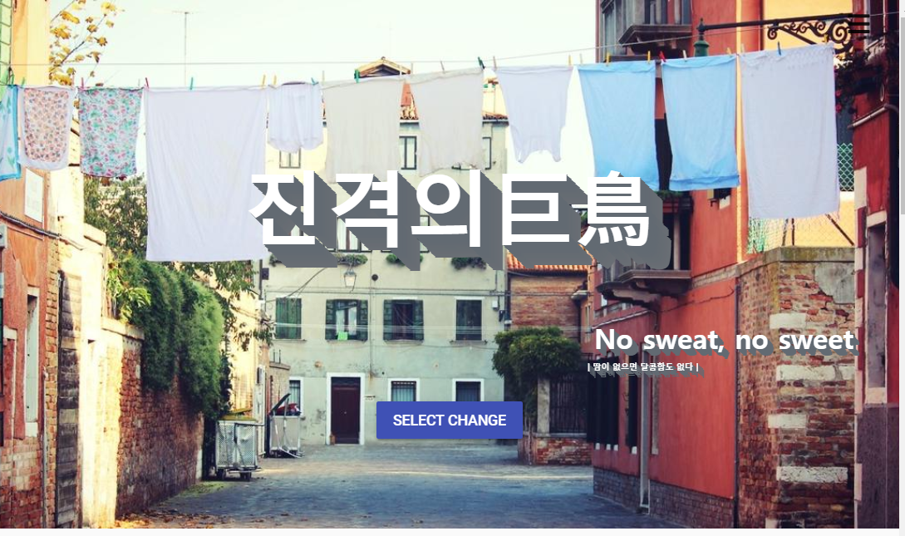

> # readMe
>
> ### req1. 사진 첨부 기능 구현
>
>1. WritePortfolio 에서 사진첨부 기능 활성화 및 섬네일로 표시되도록 기능을 추가하여야 합니다.
>2. Unsplash Link , Imgur 를 활용하여 이미지 배너 이미지를 랜덤 혹은 본인의 이미지로 선택가능하도록 구현합니다.
>
> **Imgur API 사진 첨부 기능 구현 방법**
>
> `기본적으로 Req8 에 있는 Upload Api 를 사용해야 한다`
>   
>   1. 필요한 `API` , `Add Images to an Album (Un-Authed)` , `Album Images`
>   2. `Upload Api`를 사용하여 가져온 `Response` 주소를 `Add Images to an Album (Un-Authed) Api`로 값을 넘겨준뒤 `Album Images` 에 추가된 엘범의 리스트를 뽑아내어 원하는 파일을 배너 이미지로 선정한다.
>
> `Add Images to an Album (Un-Authed)`
>
> ```js
> // 앨범에 추가하는 API
> var form = new FormData();
> // Response 에 요청된 이미지의 data 에 존재하는 imageDeleteHash 값 가져오기
> form.append("deletehashes[]", "{{imageDeleteHash}}");
>
>
> var settings = {
>   // 앨범에 존재하는 albumDeleteHash 값 가져오기
>  "url": "https://api.imgur.com/3/album/{{albumDeleteHash}}/add",
>  "method": "POST",
>  "timeout": 0,
>  "headers": {
>    "Authorization": "Client-ID {{clientId}}"
>  },
>  "processData": false,
>  "mimeType": "multipart/form-data",
>  "contentType": false,
>  "data": form
>};
> ```
>
> `Album Images`
>
> ```js
>// Imgur Album 에 들어가 있는 이미지 가져오는 API
>var form = new FormData();
>var settings = {
>  "url": "https://api.imgur.com/3/album/{{albumHash}}/images",
>  "method": "GET",
>  "timeout": 0,
>  "headers": {
>    "Authorization": "Client-ID {{clientId}}"
>  },
>  "processData": false,
>  "mimeType": "multipart/form-data",
>  "contentType": false,
>  "data": form
>};
> ```
>
> `가져온 내용으로 응용하여 프로그래밍 코드 - Imgur Upload Components`
>
>```js
><template>
>    <div>
>       <div>
>         <!-- 이미지 미리보기 -->
>         
>       </div>
>          <!-- 선택된 파일 -->
>       <input
>           id="write-select-img"
>           type="file"
>           name="file"
>           ref="file"
>           color="green darken-1"
>           v-on:change="handleFileUpload"
>        />
>           <!-- 앨범에 저장 과 동시에 Firebase 에 WritePortfolio 등록 -->
>       <div class="portfolio-agree">
>           <v-btn
>               class="portfolio-agree"
>               color="green darken-1"
>               flat
>               v-on:click="albumSave(), writePortfolio()"
>            > Agree
>           </v-btn>
>       </div>
>
>       <v-snackbar v-model="snackbar" :timeout="2000" :top="true">
>           {{ alert_alarm }}
>           <v-btn color="blue" flat @click="snackbar = false">
>                Close
>           </v-btn>
>       </v-snackbar>
>   </div>
></template>
>
><script>
>import axios from "axios";
>import FirebaseService from "@/services/FirebaseService";
>
>export default {
>  data() {
>    return {
>      file: "",
>      idhash: "",
>      imageData: "",
>      imgurUrl: "https://api.imgur.com/3/",
>      snackbar: false,
>      alert_alarm: ""
>    };
>  },
>  methods: {
>    // 파일 선택 method
>    handleFileUpload: function(event) {
>      this.file = this.$refs.file.files[0];
>      let previewImg = event.target;
>      let reader = new FileReader();
>      reader.onload = e => {
>        this.imageData = e.target.result;
>      };
>      reader.readAsDataURL(previewImg.files[0]);
>      // 선택과 동시에 Image response 값 요청
>      this.onSubmit();
>    },
>    onSubmit() {
>      let formData = new FormData();
>      const clientId = "d17f695250f6ff3";
>      formData.append("image", this.file);
>      axios({
>        method: "POST",
>        url: this.imgurUrl + "image",
>        data: formData,
>        headers: {
>          Authorization: "Client-ID " + clientId
>        },
>        mimeType: "multipart/form-data"
>      }).then(response => {
>        this.idhash = response.data.data.deletehash;
>      });
>    },
>    // Album 에 저장하는 method
>    albumSave() {
>      let formData = new FormData();
>      const clientId = "d17f695250f6ff3";
>      formData.append("deletehashes[]", this.idhash);
>      axios({
>        method: "POST",
>        url: this.imgurUrl + "album/xg5B6iNAezLtbEC/add",
>        data: formData,
>        timeout: 0,
>        headers: {
>          Authorization: "Client-ID " + clientId
>        },
>        mimeType: "multipart/form-data",
>        processData: false,
>        contentType: false
>      });
>    },
>    // Firebase에 writePortfolio 값 저장하는 method
>    writePortfolio() {
>      let title = document.getElementById("portfolio-title").value;
>      let body = document.getElementsByClassName("CodeMirror-code")[0]
>        .innerText;
>      let img = document.getElementById("write-select-img");
>      let img_value = "";
>      if (title.length && body.length) {
>        // 파일을 선택할시 파일의 주소값을 넘겨주나 선택 안할시 랜덤 주소로 Img 가 추가 된다.
>        if (img.files.length) {
>          let reader = new FileReader();
>          reader.readAsDataURL(img.files[0]);
>          reader.onload = () => {
>            img_value = reader.result;
>            FirebaseService.postPortfolio(title, body, img_value);
>          };
>        } else {
>          img_value = "https://source.unsplash.com/random";
>          FirebaseService.postPortfolio(title, body, img_value);
>        }
>        location.href = "/";
>      } else if (title.length) {
>        this.alert_alarm = "내용을 적어주세요.";
>        this.snackbar = true;
>      } else if (body.length) {
>        this.alert_alarm = "제목을 적어주세요.";
>        this.snackbar = true;
>      } else {
>        this.alert_alarm = "작성을 해주세요.";
>        this.snackbar = true;
>      }
>    }
>  }
>};
></script>
>
><style>
>.portfolio-agree {
>  margin-left: 65%;
>}
></style>
> ```
>
> `가져온 내용으로 응용하여 프로그래밍 코드 - ImgBanner Components`
>
>```js
><template>
>  <div>
>    <!-- onmouse 통해 그림에 마우스가 올라갈시 imgbutton 이 나타나거나 사라지게 만드는 이벤트 -->
>    <v-img
>      :src="imgSrc"
>      aspect-ratio="1.7"
>      onmouseover="document.getElementById('imgbutton').style.display = 'block';"
>      onmouseout="document.getElementById('imgbutton').style.display = 'none';"
>
>      <v-layout align-center justify-center row fill-height>
>        <v-flex text-xs-center>
>          <span class="text_shadow display-2 font-weight-light">
>            <slot name="text" />
>          </span>
>          <v-layout row justify-center style="margin-top: 300px;">
>            <v-dialog v-model="dialog" scrollable max-width="1000px">
>              <template v-slot:activator="{ on }">
>                <v-btn
>                  id="imgbutton"
>                  color="indigo"
>                  dark
>                  v-on:click="pull_imgur"
>                  v-on="on"
>                >
>                  Select Change
>                </v-btn>
>              </template>
>              <v-card>
>                <v-card-title>Select Image</v-card-title>
>                <v-divider></v-divider>
>                <v-card-text style="height: 500px;">
>                  <!-- 선택하려는 그림자 위에 마우스 올릴시 선택 된 이미지는 화면이 포커싱 되며 , 다른 이미지 선택할시 전 이미지는 포커싱이 사라진다. -->
>                  <!-- v-for 문을 이용하여 이미지의 주소를 나열 -->
>                  <v-img                    
>                    onmouseover="this.style.filter='alpha(opacity=50)';this.style.opacity='0.4';"
>                    onmouseout="this.style.filter='alpha(opacity=50)';this.style.opacity='50';"
>                    v-for="(image, index) in images"
>                    v-on:click.capture="change(index)"
>                    flat
>                    v-on:click="change_img"
>                    :key="image.id"
>                    :value="image.link"
>                    :label="image.link"
>                    :src="image.link"
>                  >
>                  </v-img>
>                </v-card-text>
>                <v-card-actions />
>              </v-card>
>            </v-dialog>
>          </v-layout>
>        </v-flex>
>      </v-layout>
>    </v-img>
>  </div>
></template>
>
><script>
>import axios from "axios";
>
>export default {
>  name: "ImgBanner",
>  props: {
>    text: { type: String }
>  },
>  data() {
>    return {
>      dialogm1: "",
>      dialog: false,
>      images: [],
>      img: "",
>      imgSrc: "https://source.unsplash.com/random"
>    };
>  },
>  methods: {
>    // 앨범안에 있는 리스트들 뽑아오는 method
>    pull_imgur() {
>      axios({
>        method: "get",
>        url: "https://api.imgur.com/3/album/i3i8slI/images",
>        headers: { authorization: "Client-ID " + "d17f695250f6ff3" }
>      }).then(response => {
>        if (response.data != null) {
>          this.images = response.data.data;
>        } else {
>          alert("파일이 존재하지 않습니다!!");
>        }
>      });
>    },
>    change_img() {
>      if (this.img != "") {
>        this.imgSrc = this.img;
>      } else {
>        alert("파일 주소가 없습니다.!!");
>      }
>    },
>    change(val) {
>      this.img = this.images[val].link;
>    }
>  }
>};
></script>
>
><style>
>.bottomright {
>  position: absolute;
>  bottom: 8px;
>  right: 16px;
>  font-size: 18px;
>}
></style>
>
>```
> `작동 이미지`
>
> ***ScreenShot - onmouse event*** <br>
>
>
> 
> 
>
>
> ***ScreenShot - ImgBanner*** <br>
>
>
> 
> 
> 
>
>
> ***ScreenShot - ImgBanner*** <br>
>
>
> 
>
>
>
>
>
>
