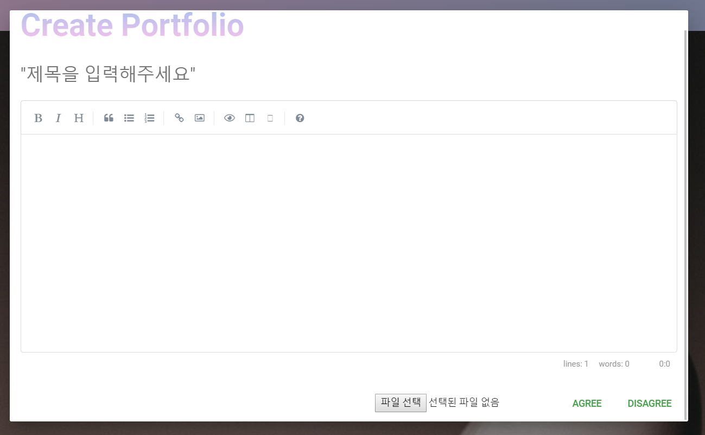
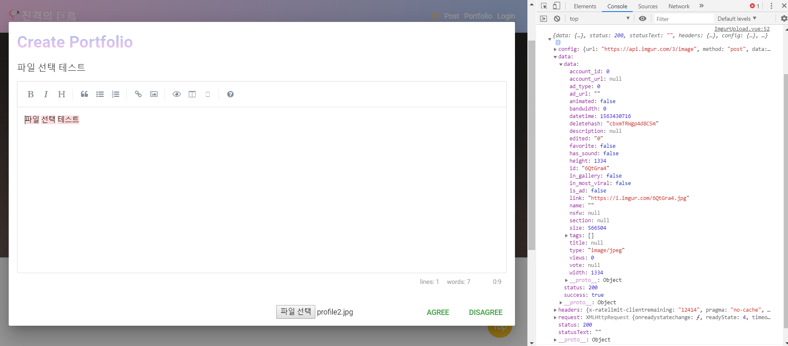

> # readMe
>
> ### req8. 이미지 업로드 컴포넌트 구현
>
>1. Imgur API 를 사용하여 이미지 업로드 컴포넌트를 구현합니다.
>2. 이미지 업로드 컴포넌트의 기능은 해당 사이트의 이미지 관련 기능에 전반적으로 사용됩니다.
>
> **Imgur API 업로드 컴포넌트**
>
> 1. [https://imgur.com/]에서 회원가입 하여 Client ID 생성
>  
> 2. [https://apidocs.imgur.com/?version=latest]에서 필요한 API 주소 가져오기
>
> 3. 필요한 `API` 는 `Image Upload`  
>
> `Image Upload`
>
> ```js
>var form = new FormData();
>form.append("image","File"); // append 할 File
>var settings = {
>    "url": "https://api.imgur.com/3/image", // 요청한 API
>    "method": "POST", // 포스트 방식
>    "timeout": 0,
>    "headers": {
>    "Authorization": "Client-ID {{clientId}}" // Client ID 입력
>    },
>    "processData": false,
>    "mimeType": "multipart/form-data",
>    "contentType": false,
>    "data": form
>};
>
>$.ajax(settings).done(function (response) {
>  console.log(response);
>});
> ```
>
> **Image Upload** 를 이용하여 **Response**의 데이터를 가져와 이미지의 링크를 가져온다.
>
> `Response`
>
>
>
>  ```js
> /* 응답 요청시 나오는 데이터 목록 */
>   {
>  "data": {
>    "id": "orunSTu",
>    "title": null,
>    "description": null,
>    "datetime": 1495556889,
>    "type": "image/gif",
>    "animated": false,
>    "width": 1,
>    "height": 1,
>    "size": 42,
>    "views": 0,
>    "bandwidth": 0,
>    "vote": null,
>    "favorite": false,
>    "nsfw": null,
>    "section": null,
>    "account_url": null,
>    "account_id": 0,
>    "is_ad": false,
>    "in_most_viral": false,
>    "tags": [],
>    "ad_type": 0,
>    "ad_url": "",
>    "in_gallery": false,
>    "deletehash": "x70po4w7BVvSUzZ",
>    "name": "",
>    "link": "http://i.imgur.com/orunSTu.gif"
>  },
>  "success": true,
>  "status": 200
>}
>```
>
> `가져온 내용으로 응용하여 프로그래밍 코드`
>
>```js
>
><template>
>  <div>
>    <input
>      class="write-select-img"
>      id="write-select-img"
>      type="file"
>      name="file"
>      ref="file"
>      color="green darken-1"
>      v-on:change="handleFileUpload"
>    />
>  </div>
></template>
>
><script>
>import axios from "axios";
>import FirebaseService from "@/services/FirebaseService";
>
>export default {
>  data() {
>    return {
>      file: "",
>      imgurUrl: "https://api.imgur.com/3/" // API 주소
>    };
>  },
>  methods: {
>    handleFileUpload() {
>      this.file = this.$refs.file.files[0]; // 선택한 파일 가져오기
>      this.onSubmit(); // 파일 선택과 동시에 주소 요청
>    },
>    onSubmit() { // Imgur에 요청하여 파일의 주소 값을 가져오게 하는 메소드
>      let formData = new FormData();
>      const clientId = "d17f695250f6ff3"; // Client ID
>      formData.append("image", this.file);
>      axios({
>        method: "POST",
>        url: this.imgurUrl + "image",
>        data: formData,
>        headers: {
>          Authorization: "Client-ID " + clientId
>        },
>        mimeType: "multipart/form-data"
>      }).then(response => { // 요청한 파일의 정보
>         console.log(response);
>      });
>    }
>  }
>};
></script>
> ```
>**참고사이트**
>
> **Imgur API**
>
> https://apidocs.imgur.com/?version=latest#c85c9dfc-7487-4de2-9ecd-66f727cf3139
>
> `작동 이미지`
>
> ScreenShot <br>
> 
> 
>
>
>
>
>
>
>
>
